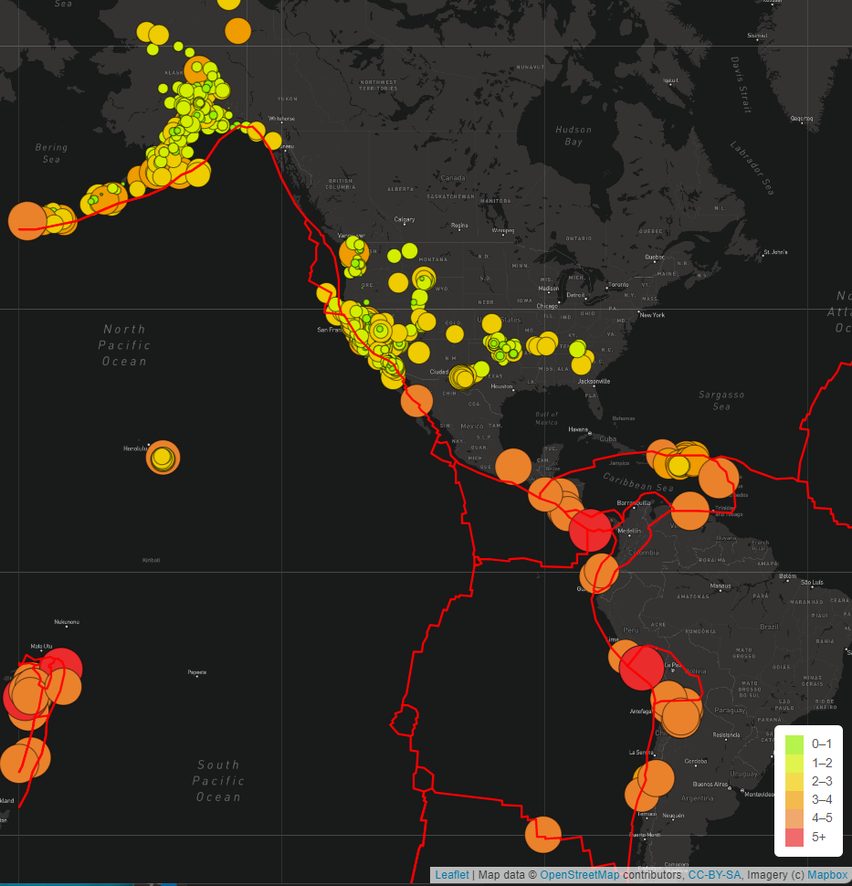

# Mapping_Earthquake_Challange
## Purpose:
          The purpose of this analysis was to create a map with earthquakes which had occured around the world by GeoJSON summary feed. We also mapped tetonic layer on the map.
## Result:
       The result presented 3 diffrent layers earthquake, major earthquakes and a tetonic plate layer. We also added different styles to map and the end product was as follows:

## Summary:
       Such interactive maps are very useful in understanding data easily. We can not only map eartquakes as we did in this exercise but can map any data with GeoJson layers, and make it meaningful.